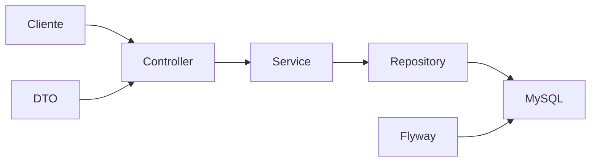
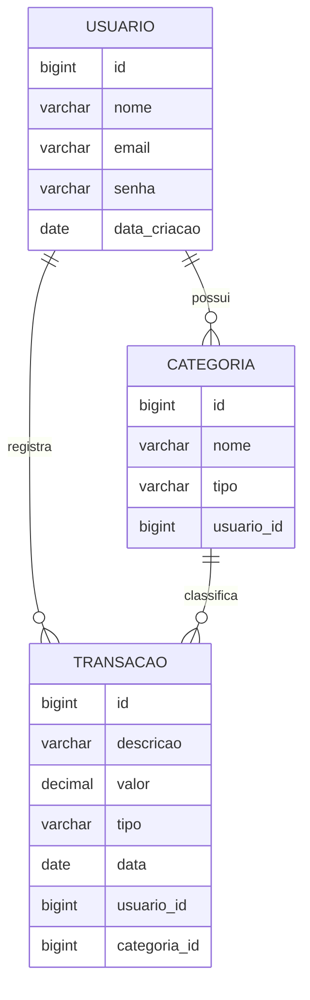

# 💰 Finanças On


### API REST para controle financeiro pessoal com Java e Spring Boot

[](https://www.java.com/)
[](https://spring.io/projects/spring-boot)
[](https://www.mysql.com/)
[](https://maven.apache.org/)

> **🚧 Status:** Em desenvolvimento. CRUDs, paginação, filtros, cálculo de saldo, DTOs de detalhamento e tratamento inicial de erros implementados.

---

# 📖 Sobre o Projeto

O **Finanças On** é uma API REST para gerenciamento financeiro pessoal desenvolvida com **Java** e **Spring Boot**.

A aplicação permite cadastrar usuários, organizar receitas e despesas por categoria, registrar transações, consultar movimentações utilizando diversos filtros e calcular automaticamente o saldo financeiro.

O projeto foi criado com foco em boas práticas de desenvolvimento Back-End, utilizando uma arquitetura em camadas semelhante à encontrada em aplicações reais.

Nesta versão também foram implementadas melhorias no contrato HTTP da API, incluindo:

* DTOs de detalhamento;
* ResponseEntity;
* Status **201 Created** em cadastros;
* Header **Location**;
* Status **204 No Content** em exclusões;
* Tratamento global inicial de erros.

---

# ✨ Destaques

* ✅ CRUD de Usuários
* ✅ CRUD de Categorias
* ✅ CRUD de Transações
* ✅ Paginação com Spring Data
* ✅ Filtros por:

  * mês
  * ano
  * categoria
  * tipo
  * faixa de valores
* ✅ Cálculo de receitas
* ✅ Cálculo de despesas
* ✅ Saldo financeiro
* ✅ DTOs
* ✅ Validações com Jakarta Validation
* ✅ BigDecimal para valores monetários
* ✅ Flyway Migration
* ✅ Tratamento global de erros
* ✅ ResponseEntity

---

# 🏗 Arquitetura



Fluxo da aplicação:

```
Cliente HTTP
      ↓
 Controller
      ↓
 Service
      ↓
 Repository
      ↓
   MySQL
```

Os DTOs definem o contrato da API e o Flyway mantém o banco versionado.

---

# 🗄 Modelo de Dados



Tipos aceitos:

```
RECEITA
DESPESA
```

---

# 🚀 Tecnologias

| Tecnologia         | Utilização             |
| ------------------ | ---------------------- |
| Java 24            | Linguagem              |
| Spring Boot        | Framework              |
| Spring Web         | API REST               |
| Spring Data JPA    | Persistência           |
| Hibernate          | ORM                    |
| MySQL              | Banco de dados         |
| Flyway             | Versionamento do banco |
| Jakarta Validation | Validações             |
| Lombok             | Redução de boilerplate |
| Maven              | Build e dependências   |

---

# ✅ Funcionalidades

## 👤 Usuários

* Cadastro
* Listagem paginada
* Consulta por ID
* Atualização
* Exclusão
* Validação de e-mail
* E-mail único
* Data de criação automática
* DTO de detalhamento

---

## 📂 Categorias

* Cadastro
* Listagem paginada
* Consulta por ID
* Atualização
* Exclusão
* Categoria vinculada ao usuário
* Validação de duplicidade
* Tipo RECEITA ou DESPESA
* DTO de detalhamento

---

## 💰 Transações

* Cadastro
* Consulta
* Atualização
* Exclusão
* Validação de valor
* Categoria pertencente ao usuário
* Filtro por mês
* Filtro por ano
* Filtro por categoria
* Filtro por tipo
* Filtro por valor mínimo
* Filtro por valor máximo
* Soma das receitas
* Soma das despesas
* Cálculo do saldo
* DTO de detalhamento

---

## 🛢 Banco de Dados

* Tabela Usuario
* Tabela Categorias
* Tabela Transações
* Chaves estrangeiras
* Flyway Migration

---

## 🌐 Respostas HTTP

* 201 Created
* 200 OK
* 204 No Content
* Header Location
* Tratamento global de exceções
* Respostas padronizadas
* Stacktrace oculto

---

# 📌 Endpoints

Base URL

```http
http://localhost:8080
```

---

## 👤 Usuário

```
POST    /financason/usuario/cadastrar
GET     /financason/usuario/listar
GET     /financason/usuario/listar/{id}
PUT     /financason/usuario/editar/{id}
DELETE  /financason/usuario/deletar/{id}
```

---

## 📂 Categoria

```
POST    /financason/categoria/cadastrar
GET     /financason/categoria/listar
GET     /financason/categoria/listar/{id}
PUT     /financason/categoria/editar/{id}
DELETE  /financason/categoria/deletar/{id}
```

---

## 💰 Transações

```
POST    /financason/transacoes/cadastrar
GET     /financason/transacoes/listar
GET     /financason/transacoes/listar/{id}
PUT     /financason/transacoes/editar/{id}
DELETE  /financason/transacoes/deletar/{id}

GET     /listar/mes/{mes}
GET     /listar/ano/{ano}
GET     /listar/categoria/{categoria}
GET     /listar/tipo/{tipo}
GET     /listar/valormin/{valor}
GET     /listar/valormax/{valor}

GET     /saldo/receita
GET     /saldo/despesa
GET     /saldo/saldofinal
```

---

# 📄 Paginação

As listagens utilizam paginação do Spring Data.

Exemplo:

```http
GET /financason/transacoes/listar?page=0&size=10&sort=data,desc
```

---

# 📨 Exemplos

## Cadastro de Usuário

```json
{
  "nome": "Ryan Miranda",
  "email": "ryan@email.com",
  "senha": "senha-segura"
}
```

---

## Cadastro de Categoria

```json
{
  "nome": "Salário",
  "tipo": "RECEITA",
  "usuarioId": 1
}
```

---

## Cadastro de Transação

```json
{
  "descricao": "Salário Mensal",
  "valor": 4500.00,
  "tipo": "RECEITA",
  "data": "2026-06-22",
  "id_categoria": 1,
  "id_usuario": 1
}
```

---

# ⚙ Como Executar

## Pré-requisitos

* Java 24
* MySQL
* Git
* Maven Wrapper

---

## Clone

```bash
git clone https://github.com/RyanMiranda01/financas_on.git

cd financas_on
```

---

## Banco

```sql
CREATE DATABASE financas_on;
```

---

## application.properties

```properties
spring.datasource.url=jdbc:mysql://localhost:3306/financas_on
spring.datasource.username=SEU_USUARIO
spring.datasource.password=SUA_SENHA
```

---

## Executar

Windows

```powershell
.\mvnw.cmd spring-boot:run
```

Linux

```bash
./mvnw spring-boot:run
```

---

A aplicação ficará disponível em

```http
http://localhost:8080
```

---

# 📂 Estrutura do Projeto

```text
src
│
├── main
│   ├── java
│   │   └── com.ryanmiranda.financas_on
│   │       ├── controller
│   │       ├── DTOs
│   │       ├── infra
│   │       ├── model
│   │       ├── repository
│   │       ├── service
│   │       └── FinancasOnApplication
│   │
│   └── resources
│       ├── db
│       │   └── migration
│       └── application.properties
│
└── test
```

---

# 📈 Roadmap

* ✅ CRUD Usuários
* ✅ CRUD Categorias
* ✅ CRUD Transações
* ✅ Paginação
* ✅ Filtros
* ✅ DTOs
* ✅ ResponseEntity
* ✅ Tratamento Global de Erros
* ⏳ Spring Security
* ⏳ JWT
* ⏳ BCrypt
* ⏳ Swagger / OpenAPI
* ⏳ Testes Unitários
* ⏳ Docker
* ⏳ Docker Compose
* ⏳ Deploy em Nuvem

---

# 💡 Competências Demonstradas

* Java
* Spring Boot
* Spring MVC
* Spring Data JPA
* Hibernate
* REST API
* Arquitetura em Camadas
* DTO Pattern
* JPQL
* Paginação
* Validação
* Tratamento Global de Erros
* ResponseEntity
* Flyway
* MySQL
* Modelagem Relacional
* Regras de Negócio
* Versionamento de Banco

---

# 👨‍💻 Autor

**Ryan Miranda Barbosa**

⭐ Se este projeto foi útil para você, considere deixar uma estrela no repositório!
