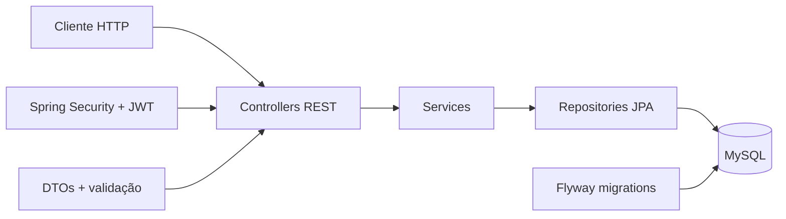
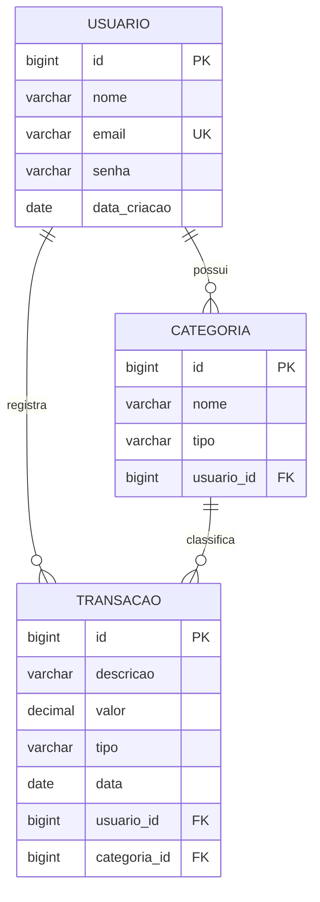

# Finanças On

API REST para controle financeiro pessoal desenvolvida com Java e Spring Boot.

[](https://www.java.com/)
[](https://spring.io/projects/spring-boot)
[](https://www.mysql.com/)
[](https://maven.apache.org/)
[](https://spring.io/projects/spring-security)

## Sobre o Projeto

O Finanças On é uma API REST para gerenciamento financeiro pessoal. A aplicação permite cadastrar usuários, organizar receitas e despesas por categoria, registrar transações, consultar movimentações com filtros e calcular o saldo financeiro.

O projeto foi construído com arquitetura em camadas, separando responsabilidades entre controllers, services, repositories, DTOs, entidades, regras de negócio, segurança e persistência relacional com MySQL.

## Status

Em desenvolvimento. CRUDs, paginação, filtros, cálculo de saldo, tratamento global de erros e autenticação com JWT já estão implementados.

## Atualizações Recentes

- Autenticação com Spring Security.
- Endpoint de login com geração de token JWT.
- Proteção das rotas com filtro stateless.
- Cadastro de usuário com senha criptografada usando BCrypt.
- Usuário integrado ao contrato `UserDetails` do Spring Security.
- Validação de token via `Authorization: Bearer <token>`.
- Migration para ampliar o campo `senha` e comportar hashes BCrypt.
- Reorganização dos DTOs de autenticação dentro da infraestrutura de segurança.

## Principais Funcionalidades

- CRUD de usuários.
- CRUD de categorias.
- CRUD de transações.
- Listagens paginadas com Spring Data.
- Filtros de transações por mês, ano, categoria, tipo e faixa de valor.
- Totalização de receitas.
- Totalização de despesas.
- Cálculo do saldo final.
- Relacionamento entre usuário, categoria e transação.
- Validações com Jakarta Validation.
- Valores monetários com `BigDecimal`.
- Versionamento do banco com Flyway.
- Tratamento global de exceções.
- Autenticação JWT.

## Arquitetura



## Modelo de Dados



Os tipos financeiros aceitos são `RECEITA` e `DESPESA`.

## Tecnologias

| Tecnologia | Uso no projeto |
| --- | --- |
| Java 25 | Linguagem principal |
| Spring Boot 4.1.0 | Configuração e execução da aplicação |
| Spring Web MVC | Endpoints REST |
| Spring Data JPA / Hibernate | Persistência e consultas |
| Spring Security | Autenticação e proteção das rotas |
| Java JWT | Geração e validação de tokens |
| BCrypt | Criptografia de senhas |
| Jakarta Validation | Validação dos dados de entrada |
| Flyway | Versionamento do banco de dados |
| MySQL | Banco de dados relacional |
| Lombok | Redução de boilerplate |
| Maven Wrapper | Build e execução |

## Segurança

As rotas de cadastro e login são públicas:

```http
POST /financason/usuario/cadastrar
POST /financason/usuario/login
```

As demais rotas exigem token JWT no cabeçalho:

```http
Authorization: Bearer SEU_TOKEN_JWT
```

O login recebe `email` e `senha`, autentica o usuário e retorna um token:

```json
{
  "token": "jwt-gerado-pela-api"
}
```

## Endpoints

URL base local:

```http
http://localhost:8080
```

### Usuários

| Método | Endpoint | Descrição |
| --- | --- | --- |
| `POST` | `/financason/usuario/cadastrar` | Cadastra um usuário |
| `POST` | `/financason/usuario/login` | Autentica e retorna um JWT |
| `GET` | `/financason/usuario/listar` | Lista usuários com paginação |
| `GET` | `/financason/usuario/listar/{id}` | Busca usuário por ID |
| `PUT` | `/financason/usuario/editar/{id}` | Atualiza usuário |
| `DELETE` | `/financason/usuario/deletar/{id}` | Remove usuário |

### Categorias

| Método | Endpoint | Descrição |
| --- | --- | --- |
| `POST` | `/financason/categoria/cadastrar` | Cadastra categoria |
| `GET` | `/financason/categoria/listar` | Lista categorias com paginação |
| `GET` | `/financason/categoria/listar/{id}` | Busca categoria por ID |
| `PUT` | `/financason/categoria/editar/{id}` | Atualiza categoria |
| `DELETE` | `/financason/categoria/deletar/{id}` | Remove categoria |

### Transações

| Método | Endpoint | Descrição |
| --- | --- | --- |
| `POST` | `/financason/transacoes/cadastrar` | Cadastra transação |
| `GET` | `/financason/transacoes/listar` | Lista transações com paginação |
| `GET` | `/financason/transacoes/listar/{id}` | Busca transação por ID |
| `PUT` | `/financason/transacoes/editar/{id}` | Atualiza transação |
| `DELETE` | `/financason/transacoes/deletar/{id}` | Remove transação |
| `GET` | `/financason/transacoes/listar/mes/{mes}` | Filtra por mês |
| `GET` | `/financason/transacoes/listar/ano/{ano}` | Filtra por ano |
| `GET` | `/financason/transacoes/listar/categoria/{categoria}` | Filtra por categoria |
| `GET` | `/financason/transacoes/listar/tipo/{tipo}` | Filtra por tipo |
| `GET` | `/financason/transacoes/listar/valormin/{valor}` | Filtra por valor mínimo |
| `GET` | `/financason/transacoes/listar/valormax/{valor}` | Filtra por valor máximo |
| `GET` | `/financason/transacoes/saldo/receita` | Total de receitas |
| `GET` | `/financason/transacoes/saldo/despesa` | Total de despesas |
| `GET` | `/financason/transacoes/saldo/saldofinal` | Saldo final |

## Exemplos de Requisição

### Cadastro de usuário

```json
{
  "nome": "Ryan Miranda",
  "email": "ryan@email.com",
  "senha": "senha-segura"
}
```

### Login

```json
{
  "email": "ryan@email.com",
  "senha": "senha-segura"
}
```

### Cadastro de categoria

```json
{
  "nome": "Salário",
  "tipo": "RECEITA",
  "usuarioId": 1
}
```

### Cadastro de transação

```json
{
  "descricao": "Salário mensal",
  "valor": 4500.00,
  "tipo": "RECEITA",
  "data": "2026-06-22",
  "id_categoria": 1,
  "id_usuario": 1
}
```

## Paginação

As listagens aceitam os parâmetros padrão do Spring Data:

```http
GET /financason/transacoes/listar?page=0&size=10&sort=data,desc
```

## Como Executar

### Pré-requisitos

- Java 25.
- MySQL.
- Git.
- Maven Wrapper, já incluído no projeto.

### Clone o repositório

```bash
git clone https://github.com/RyanMiranda01/financas_on.git
cd financas_on
```

### Crie o banco de dados

```sql
CREATE DATABASE financas_on;
```

### Configure a aplicação

Atualize `src/main/resources/application.properties` conforme seu ambiente:

```properties
spring.datasource.driver-class-name=com.mysql.cj.jdbc.Driver
spring.datasource.url=jdbc:mysql://localhost/financas_on
spring.datasource.username=SEU_USUARIO
spring.datasource.password=SUA_SENHA

spring.jpa.show-sql=true
spring.jpa.properties.hibernate.format_sql=true

server.error.include-stacktrace=never
api.security.token.secret=SUA_CHAVE_SECRETA
```

### Execute

Windows:

```powershell
.\mvnw.cmd spring-boot:run
```

Linux/macOS:

```bash
./mvnw spring-boot:run
```

## Estrutura

```text
src
├── main
│   ├── java
│   │   └── com.ryanmiranda.financas_on
│   │       ├── controller
│   │       ├── DTOs
│   │       ├── infra
│   │       │   ├── exception
│   │       │   └── security
│   │       ├── model
│   │       ├── repository
│   │       └── service
│   └── resources
│       ├── db/migration
│       └── application.properties
└── test
```

## Roadmap

- Swagger/OpenAPI.
- Testes unitários e de integração.
- Docker e Docker Compose.
- Variáveis de ambiente para credenciais e segredo JWT.
- Melhorias nas mensagens de erro.
- Deploy em nuvem.

## Autor

Ryan Miranda Barbosa

