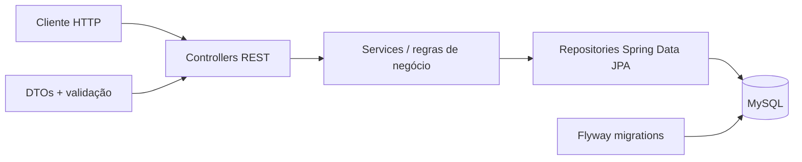
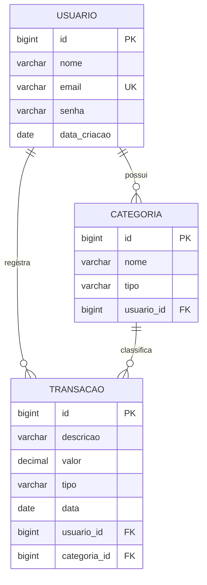

# Finanças On

### API REST para controle financeiro pessoal com Java e Spring Boot

[](https://www.java.com/)
[](https://spring.io/projects/spring-boot)
[](https://www.mysql.com/)
[](https://maven.apache.org/)


**Status:** em desenvolvimento — CRUDs, paginação, filtros e cálculo de saldos implementados.

</div>

---

## Sobre o projeto

O **Finanças On** é uma API REST de gerenciamento financeiro pessoal. A aplicação permite cadastrar usuários, organizar receitas e despesas por categoria, registrar transações, consultar movimentações com diferentes filtros e calcular o saldo financeiro.

O projeto foi construído para praticar uma arquitetura back-end próxima de um cenário real, com separação de responsabilidades entre controllers, services, repositories, DTOs e entidades, persistência relacional e versionamento do banco de dados.

## Destaques

- CRUD de usuários, categorias e transações.
- Listagens paginadas com Spring Data.
- Filtros por mês, ano, categoria, tipo e faixa de valor.
- Cálculo de total de receitas, total de despesas e saldo final.
- Relacionamentos entre usuário, categoria e transação.
- Validações com Jakarta Validation e regras de negócio na camada de serviço.
- Valores monetários representados com `BigDecimal`.
- Banco MySQL versionado por migrations do Flyway.
- Uso de DTOs para separar o contrato da API das entidades persistidas.

## Arquitetura



O fluxo de uma requisição passa pela camada HTTP, pelas regras de negócio e pela persistência. Os DTOs definem os dados de entrada e saída, enquanto o Flyway mantém o esquema do banco reproduzível.

## Modelo de dados



Os tipos financeiros aceitos são `RECEITA` e `DESPESA`.

## Tecnologias

| Tecnologia | Uso no projeto |
|---|---|
| Java 25 | Linguagem principal |
| Spring Boot 4.1 | Configuração e execução da aplicação |
| Spring Web MVC | Endpoints REST |
| Spring Data JPA / Hibernate | Persistência e consultas |
| Jakarta Validation | Validação dos dados de entrada |
| Flyway | Versionamento do banco de dados |
| MySQL | Banco de dados relacional |
| Lombok | Redução de código repetitivo nas entidades |
| Maven / Maven Wrapper | Dependências, build e execução |

## Funcionalidades implementadas

### Usuários

- Cadastro de usuário.
- Listagem paginada.
- Consulta por ID.
- Atualização de nome e e-mail.
- Exclusão.
- Validação do formato do e-mail.
- Bloqueio de e-mail duplicado.
- Registro automático da data de criação.

### Categorias

- Cadastro de categoria vinculada a um usuário.
- Classificação como `RECEITA` ou `DESPESA`.
- Listagem paginada.
- Consulta por ID.
- Atualização e exclusão.
- Bloqueio de categoria com nome duplicado.

### Transações

- Cadastro vinculado a usuário e categoria.
- Listagem paginada e consulta por ID.
- Atualização de descrição e valor.
- Exclusão.
- Validação de valor maior que zero.
- Validação de que a categoria pertence ao usuário informado.
- Filtro por mês.
- Filtro por ano.
- Filtro por nome da categoria.
- Filtro por tipo (`RECEITA` ou `DESPESA`).
- Filtro por valor mínimo.
- Filtro por valor máximo.
- Totalização das receitas.
- Totalização das despesas.
- Cálculo do saldo final: receitas menos despesas.

### Banco de dados

- Criação das tabelas `usuario`, `categorias` e `transicoes`.
- E-mail de usuário com restrição de unicidade.
- Chaves estrangeiras entre usuários, categorias e transações.
- Quatro migrations SQL executadas automaticamente pelo Flyway.

## Endpoints da API

A URL base local é `http://localhost:8080`.

### Usuários — `/financason/usuario`

| Método | Endpoint | Descrição |
|---|---|---|
| `POST` | `/cadastrar` | Cadastra um usuário |
| `GET` | `/listar` | Lista usuários com paginação |
| `GET` | `/listar/{id}` | Busca um usuário por ID |
| `PUT` | `/editar/{id}` | Atualiza um usuário |
| `DELETE` | `/deletar/{id}` | Exclui um usuário |

### Categorias — `/financason/categoria`

| Método | Endpoint | Descrição |
|---|---|---|
| `POST` | `/cadastrar` | Cadastra uma categoria |
| `GET` | `/listar` | Lista categorias com paginação |
| `GET` | `/listar/{id}` | Busca uma categoria por ID |
| `PUT` | `/editar/{id}` | Atualiza uma categoria |
| `DELETE` | `/deletar/{id}` | Exclui uma categoria |

### Transações — `/financason/transacoes`

| Método | Endpoint | Descrição |
|---|---|---|
| `POST` | `/cadastrar` | Cadastra uma transação |
| `GET` | `/listar` | Lista transações com paginação |
| `GET` | `/listar/{id}` | Busca uma transação por ID |
| `PUT` | `/editar/{id}` | Atualiza descrição e valor |
| `DELETE` | `/deletar/{id}` | Exclui uma transação |
| `GET` | `/listar/mes/{mes}` | Filtra pelo número do mês |
| `GET` | `/listar/ano/{ano}` | Filtra pelo ano |
| `GET` | `/listar/categoria/{categoria}` | Filtra pelo nome da categoria |
| `GET` | `/listar/tipo/{tipo}` | Filtra por receita ou despesa |
| `GET` | `/listar/valormin/{valor}` | Retorna valores maiores ou iguais ao mínimo |
| `GET` | `/listar/valormax/{valor}` | Retorna valores menores ou iguais ao máximo |
| `GET` | `/saldo/receita` | Calcula o total de receitas |
| `GET` | `/saldo/despesa` | Calcula o total de despesas |
| `GET` | `/saldo/saldofinal` | Calcula receitas menos despesas |

### Paginação e ordenação

As rotas de listagem e filtros paginados aceitam os parâmetros do Spring Data:

```http
GET /financason/transacoes/listar?page=0&size=10&sort=data,desc
```

## Exemplos de requisição

### Cadastrar usuário

```http
POST /financason/usuario/cadastrar
Content-Type: application/json
```

```json
{
  "nome": "Ryan Miranda",
  "email": "ryan@email.com",
  "senha": "senha-segura"
}
```

### Cadastrar categoria

```http
POST /financason/categoria/cadastrar
Content-Type: application/json
```

```json
{
  "nome": "Salário",
  "tipo": "RECEITA",
  "usuarioId": 1,
  "data": "2026-06-22"
}
```

### Cadastrar transação

```http
POST /financason/transacoes/cadastrar
Content-Type: application/json
```

```json
{
  "descricao": "Salário mensal",
  "valor": 4500.00,
  "tipo": "RECEITA",
  "data": "2026-06-22",
  "id_categoria": 1,
  "id_usuario": 1
}
```

### Consultar despesas

```http
GET /financason/transacoes/listar/tipo/DESPESA?page=0&size=10&sort=data,desc
```

## Como executar

### Pré-requisitos

- Java 25.
- MySQL em execução.
- Git. O Maven Wrapper já acompanha o projeto.

### 1. Clone o repositório

```bash
git clone https://github.com/RyanMiranda01/financas_on.git
cd financas_on
```

### 2. Crie o banco

```sql
CREATE DATABASE financas_on;
```

### 3. Configure a conexão

Atualize `src/main/resources/application.properties` com as credenciais do seu ambiente:

```properties
spring.datasource.url=jdbc:mysql://localhost:3306/financas_on
spring.datasource.username=SEU_USUARIO
spring.datasource.password=SUA_SENHA
```

Ao iniciar a aplicação, o Flyway cria e atualiza as tabelas automaticamente.

### 4. Inicie a API

No Windows:

```powershell
.\mvnw.cmd spring-boot:run
```

No Linux ou macOS:

```bash
./mvnw spring-boot:run
```

A API ficará disponível em `http://localhost:8080`.

## Estrutura do projeto

```text
src
├── main
│   ├── java/com/ryanmiranda/financas_on
│   │   ├── controller      # Camada HTTP
│   │   ├── DTOs            # Contratos de entrada e saída
│   │   ├── model           # Entidades JPA e enum Tipo
│   │   ├── repository      # Persistência e consultas
│   │   ├── service         # Regras de negócio
│   │   └── FinancasOnApplication.java
│   └── resources
│       ├── db/migration    # Scripts versionados do Flyway
│       └── application.properties
└── test                    # Estrutura inicial de testes
```

## Evolução do projeto

- [x] Configuração inicial com Spring Boot e MySQL.
- [x] CRUD de usuários.
- [x] CRUD de categorias.
- [x] CRUD de transações.
- [x] Paginação.
- [x] Filtros por mês, ano, categoria, tipo e valores.
- [x] Cálculo de receitas, despesas e saldo final.
- [ ] Tratamento global de exceções.
- [ ] Spring Security e JWT.
- [ ] Documentação com Swagger / OpenAPI.
- [ ] Testes unitários e de integração.
- [ ] Docker e Docker Compose.
- [ ] Deploy em nuvem.

## Competências demonstradas

Este projeto reúne competências relevantes para desenvolvimento back-end Java: modelagem relacional, construção de APIs REST, arquitetura em camadas, validação, persistência com JPA, consultas com JPQL, paginação, regras de negócio financeiro e versionamento de banco de dados.

## Autor

Desenvolvido por **Ryan Miranda Barbosa**.

Se o projeto foi útil para você, considere deixar uma ⭐ no repositório.
